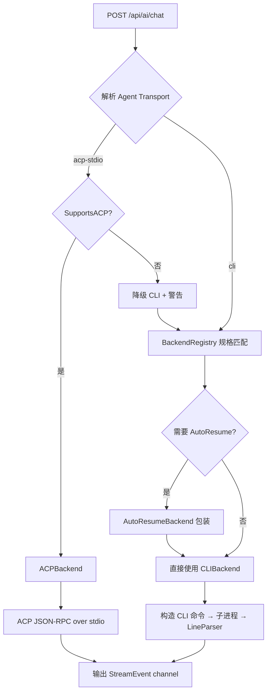
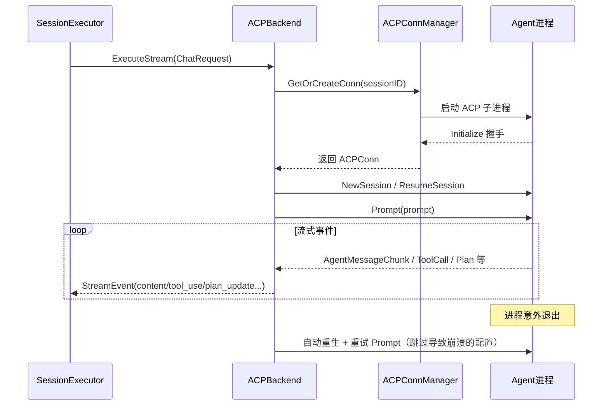
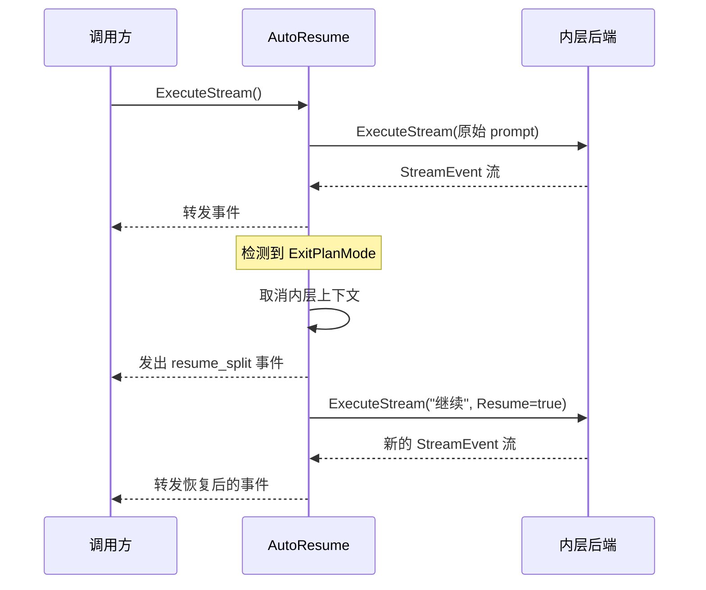

# AI 后端抽象

ClawBench 支持多种 AI 工具，每种工具的调用方式、输出格式各不相同。AI 后端抽象层将这种差异封装为统一的 `AIBackend` 接口——handler 只需调用 `ExecuteStream()`，不关心背后是 Claude 还是 Kimi。系统支持两种传输模式：CLI shell-out（传统模式，通过 stdout 流式解析）和 ACP stdio（Agent Client Protocol，通过 JSON-RPC 双向通信，提供模式切换、斜杠命令和权限管理等结构化能力）。12 个后端在 `BackendRegistry` 中声明规格（CLI 命令、模型发现策略、ACP 命令），factory 根据后端类型创建对应的 `AIBackend` 实例。传输选择在 factory 层根据 Agent 的 `Transport` 字段决定，调用方完全透明。

## 流程图

### 后端选择与传输分流

### ACP 连接与执行流程

### AutoResume 流程（仅 CLI 模式）

AutoResume 只用于 CLI 模式后端。ACP 后端使用会话级取消而非进程终止来处理卡死，不需要 AutoResume 的"杀进程→恢复"模式。某些 CLI 后端（Claude、Codebuddy、Qoder 等）在计划审批时触发 ExitPlanMode——AutoResumeBackend 自动处理：检测到后取消当前执行，自动恢复并继续，对调用方透明。

## 功能与设计要点

### 功能清单

- **统一流式接口**：所有 AI 后端实现 `AIBackend` 接口，对外暴露统一的 `ExecuteStream()` 方法，返回 `<-chan StreamEvent`。调用方无需关心底层差异
- **双传输模式**：CLI shell-out（传统模式，通过 stdout 解析）和 ACP stdio（JSON-RPC 双向通信，提供模式切换、斜杠命令、权限审批等结构化能力）。Agent 的 `Transport` 字段决定使用哪种传输，可按会话切换
- **多后端支持**：支持 12 种 AI 后端（Claude、Codebuddy、OpenCode、Codex、Qoder、VeCLI、DeepSeek/CodeWhale、Cline、Kimi、Copilot、MiMo-Code、Pi），每个后端在 `BackendRegistry` 中声明规格（CLI 命令、模型发现策略、ACP 命令），factory 根据后端类型创建对应的 `AIBackend` 实例
- **ACP 连接管理**：每个聊天会话独占一个 ACP 连接（一对一模型），5 分钟空闲自动回收，活跃会话受保护不被回收。连接断开后自动重生并重试，崩溃的配置值自动跳过
- **自动恢复（AutoResume）**：仅 CLI 模式。对 ExitPlanMode 场景自动执行"取消→恢复继续"流程，避免用户手动干预
- **流式事件标准化**：各后端不同的输出格式经 LineParser（CLI）或 ACP 事件翻译层（ACP）统一为标准 StreamEvent 类型。ACP 额外提供 mode_update、config_update、thinking_effort_update、plan_update、model_list_update、commands_update 等能力事件
- **ACP 权限审批**：ACP 后端请求用户审批工具调用时，系统推送 `permission_pending` 事件，前端展示审批界面，用户批准/拒绝后通过 `/api/ai/permission/respond` 回传。移动端通过 JPush 通知收到审批提醒
- **工具名称归一化**：不同后端对同一操作使用不同的工具名称（如 `read_file` vs `Read`），归一化层统一映射，保证前端显示和 RAG 索引的一致性
- **孤儿进程清理**：服务启动时扫描系统中的 AI 子进程孤儿（通过环境变量标记），检查父进程存活后安全清理。防止服务崩溃后遗留的进程占用资源

### 设计要点

- **双传输分流在 factory 层**：`NewBackendForAgentWithTransport` 根据 Agent 的 `Transport` 字段（"cli" / "acp-stdio"）决定创建 ACPBackend 还是 CLIBackend。ACP 不可用时降级到 CLI 并记录警告——用户选择 ACP 是有意的，降级是容错而非静默回退
- **ACP 一对一而非连接池**：`ACPConnManager` 是单例，管理每个 ClawBench 会话独占一个 ACP 连接。AI Agent 的会话状态是私有的，无法在连接间共享
- **CLIBackend 是通用骨架**：所有 shell-out 后端共享 `CLIBackend` 的进程管理、stdout 管道、上下文取消逻辑，差异仅在于 CLI 参数构建和输出解析策略——新增后端只需提供这两个策略
- **后端规格集中声明**：所有后端的规格（CLI 命令、模型发现策略、ACP 命令）在 `BackendRegistry` 中集中声明，factory 通过后端类型字符串匹配创建实例。新增后端需要同时添加规格条目和 factory 分支
- **AutoResumeBackend 是透明包装器**：仅包装 CLI 后端。ACP 后端不使用 AutoResume——ACP 用会话级取消替代进程终止，两种取消策略不兼容
- **ACP 状态缓存与重发**：每个连接缓存当前的 mode、thinking effort、config、commands、plan 状态。新连接或重连时自动重发，保证前端在任何时刻都能恢复完整的 UI 状态
- **ACP 工具调用防抖**：`ToolCallUpdate` 事件以 50ms 窗口批量发送，将 SSE 事件率降低约 95% 而不丢失信息——AI 工具调用的流式更新频率极高，逐条推送会淹没前端
- **Agent 存储是纯 DB 驱动**：Agent 配置存储在数据库（`agents` 表），YAML 仅用于手动定义的特殊 Agent。DB 优先，`source` 字段区分 "auto"（自动发现）和 "setup"（向导创建）。ACP 相关字段（`transport`、`acp_command`、可用模式/思考深度/命令等）持久化在 `agents` 表中，重启后无需重新发现
