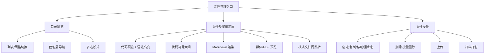
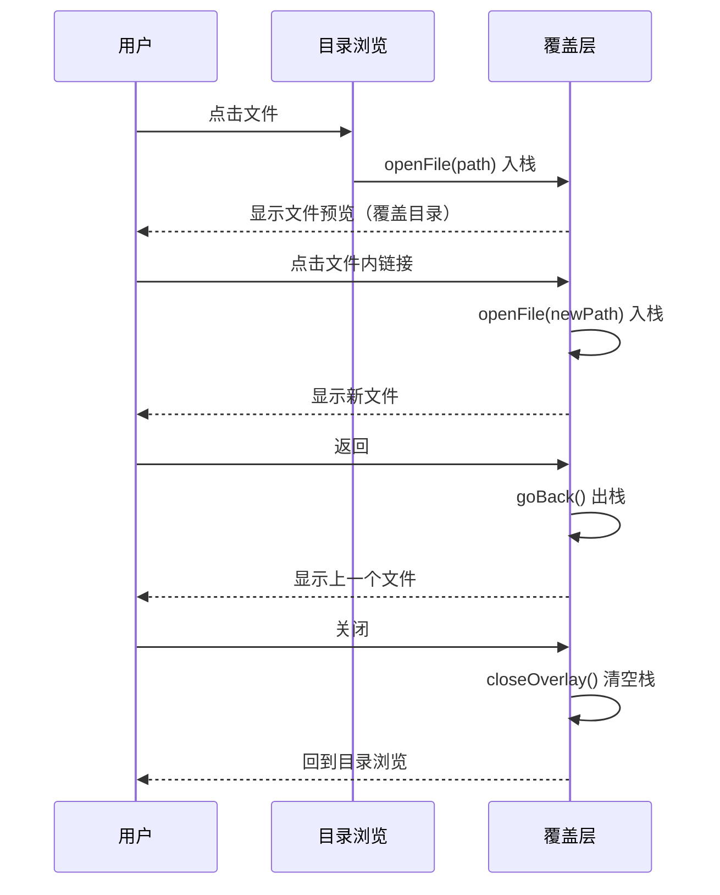
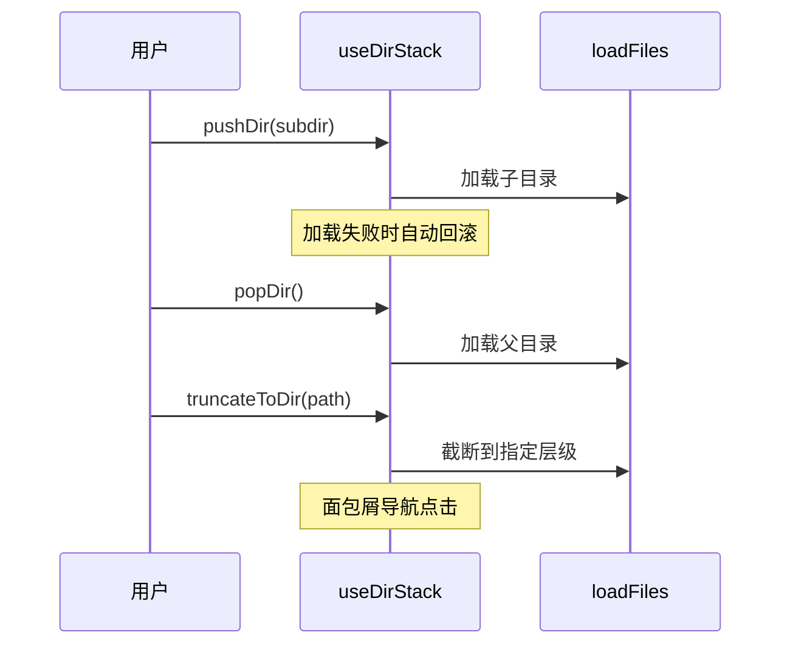
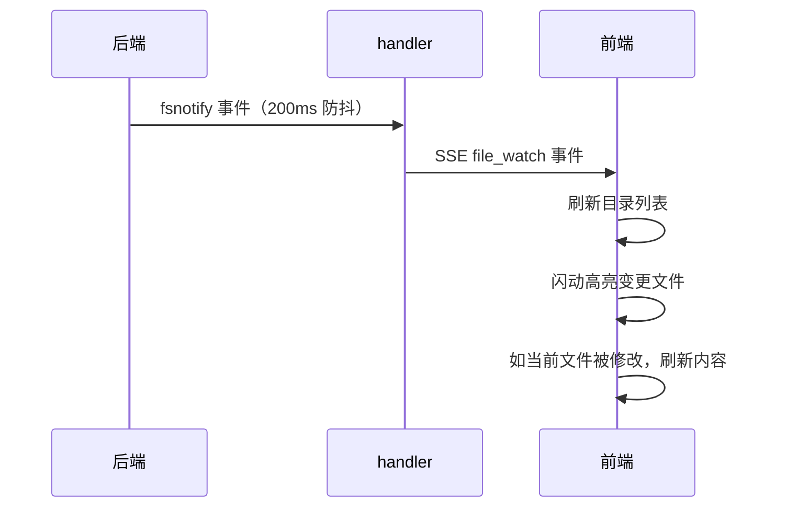

# 文件管理

文件管理让用户在 Web 界面中浏览、查看、编辑、上传项目文件——这是代码工作站的基座能力。浏览和查看共用一个 Tab（browse），文件预览以覆盖层形式叠加在目录浏览之上，支持栈式导航在文件间跳转。目录浏览也采用栈式导航，支持多级目录的 push/pop/truncate 操作。文件路径标注支持双候选路径解析，优先基于当前文件目录解析，解析失败时自动回退到项目根目录。从目录浏览到代码预览，从文件上传到符号提取，覆盖了日常开发中"看代码、传文件、下归档"的核心场景。

## 流程图

### 文件操作链路

### 文件覆盖层导航

### 目录导航栈

### 文件变更监听

## 功能与设计要点

### 功能清单

- **目录浏览**：列表和网格两种视图，面包屑导航，支持多选操作。目录导航采用栈式模型，支持 push/pop/truncate 操作，加载失败时自动回滚到上一个状态。移动端文件浏览最基本的能力
- **文件预览覆盖层**：点击文件时在目录浏览之上弹出覆盖层预览文件内容，不需要切换 Tab。覆盖层支持栈式导航——文件中的链接可以继续打开新文件（入栈），返回时出栈回到上一个文件，关闭覆盖层清空栈回到目录
- **文件查看**：代码文件（语法高亮 + 行号 + 可点击文件路径）、Markdown（渲染预览）、图片/PDF/音频/视频预览。覆盖了项目中常见的文件类型
- **代码符号提取**：通过 tree-sitter（纯 Go，无 CGO）从源代码文件提取 17 种符号（class、function、method、variable 等），支持 200+ 编程语言。用户快速了解文件的结构和 API
- **文件操作**：创建、复制、移动、重命名、删除、批量删除。所有路径操作都经过 symlink 感知的穿越防护，确保不会访问项目根目录之外的文件——安全是文件操作的底线
- **文件上传**：支持多文件上传，带进度跟踪。大小和数量由配置限制（`upload.max_size_mb`、`upload.max_files`）
- **缩略图生成**：图片文件自动生成缩略图，用于列表和网格视图的预览。避免加载全尺寸图片消耗带宽
- **归档打包**：选择文件/目录打包为 zip/tar 下载。移动端不方便 `tar czf`，一键打包是刚需
- **文件变更监听**：后端通过 fsnotify 监听文件变更，SSE 推送给前端，前端自动刷新目录和文件内容。用户不用手动刷新就能看到 AI 编辑的代码变化
- **文件路径标注**：聊天中和代码预览中出现的文件路径自动标注为可点击链接，点击打开文件查看器。支持双候选路径解析：优先基于当前文件所在目录（baseDir）解析相对路径，解析失败时自动回退到项目根目录解析——解决相对路径在不同上下文中可能指向不同文件的问题。外部文件路径（项目根目录之外）也可标注和打开

### 设计要点

- **浏览与查看合一**：合并了原来的 browse 和 viewer 两个 Tab，文件预览以覆盖层形式叠加在目录浏览之上。覆盖层使用绝对定位和滑入动画，视觉上是全屏预览，但底层目录状态保留——关闭覆盖层后直接回到目录
- **栈式导航支持深度跳转**：文件内的链接（代码中的 import、聊天中标注的路径）可以继续打开新文件，所有打开的文件构成导航栈。这与浏览器的前进/后退类似，但专门为代码阅读优化
- **目录导航栈是模块级单例**：`useDirStack` 使用模块级 `ref`，所有组件共享同一份导航栈状态。栈操作（push/pop/truncate）配合 `loadFiles` 使用时带自动回滚——加载失败时恢复到变更前的栈状态，避免 UI 与实际目录不一致
- **双候选路径解析**：文件路径标注时，相对路径同时解析出 baseDir 候选和 projectRoot 候选。标注阶段存储两个候选路径，异步验证时如果主候选不存在但备选存在，自动替换——避免因路径解析上下文不同而导致标注失效
- **路径穿越防护是 symlink 感知的**：路径校验先解析 symlink 再判断是否在项目根目录下——简单的字符串比较会被 symlink 绕过
- **fsnotify 防抖**：文件保存可能触发多个底层事件（写入、属性变更、close），防抖避免前端反复刷新
- **缩略图是按需生成的**：不预生成所有图片的缩略图，而是请求时才生成——节省存储空间，且缩略图可从原图随时重建
- **符号提取有文件大小限制**：超过 1MB 的文件跳过符号提取，避免大文件拖慢响应。Markdown 文件特殊处理，提取标题层级而非代码符号
